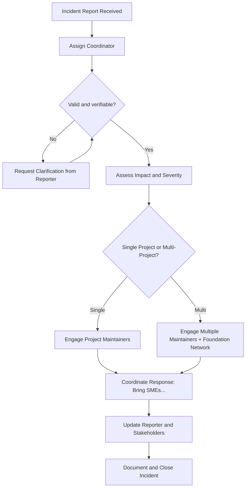

# Incident Response Plan

## Purpose & Role  

This plan outlines how the OpenJS Foundation facilitates and coordinates responses to security incidents affecting supported projects.  

The Foundation acts as a **facilitator and coordinator**, not as the primary incident responder. Our focus is to unblock projects and reduce risk by:

- Connecting the right people and resources  
- Coordinating communication between affected parties  
- Providing guidance on best practices and mitigation strategies  
- Facilitating access to subject matter experts  
- Ensuring incidents follow responsible disclosure timelines  

**We do not:**  
- Directly fix code vulnerabilities  
- Manage individual project security  
- Serve as the first responder for project-level technical issues  

This approach respects project autonomy while leveraging the Foundation’s position in the ecosystem to resolve incidents efficiently.  

---

## Scope & Incident Categories  

This plan applies to incidents such as:  
- **Platform or provider security issues** (e.g., authentication compromise, unexpected data exposure, outages affecting security controls)  
- **Account or registry access issues** (e.g., npm lockdown, GitHub MFA lockout, compromised maintainer account)  
- **Supply chain attacks** (e.g., malicious package versions, phishing campaigns, dependency compromises)  
- **Legal or operational threats** (e.g., license disputes, patent challenges, DMCA takedowns, trademark misuse)  

**Out of Scope:**  
- Code-level vulnerabilities in Foundation projects (handled by the project or OpenJS CNA Team)  
- Non-Foundation projects — see [supported projects list](https://openjsf.org/projects)  

🍿 @Discussion: Probably we can think on more scenarios together  

| Category | Examples | Primary Response Role |
|----------|----------|-----------------------|
| **Vulnerability Report** | Code exploit, CVE disputes, escalations | Redirect to project / CNA Team |
| **Platform Security Issue** | Authentication compromise, data exposure, outages | Triage → Escalate to platform → Mitigation guidance |
| **Account Access Issue** | npm account lockout, GitHub MFA | Triage → Work with provider → Temporary mitigation |
| **Supply Chain Attack** | Malicious dependency release | Coordinate with affected projects → Security advisories |
| **External Provider Incident** | Cloud/service compromise | Facilitate communication between maintainers & provider |

---

## Roles & Responsibilities  

### RACI Overview  

[More on RACI](https://www.atlassian.com/work-management/project-management/raci-chart)  

| Process Step | Reporter | Foundation Response Team | Coordinator (SRC) | SME |
|--------------|----------|--------------------------|-------------------|-----|
| File Report | R, A | C | I |  |
| Assign Coordinator | I | R | A |  |
| Assess Impact & Severity | I | C | A | C |
| Identify SMEs | I | C | A | C |
| Recommend Mitigation | I | C | A | C |
| Document Findings | I | C | A | I, C |
| Publish/Share (if approved) | I | R, A | C | C |

🍿 @Discussion: who should be in the team?  
🍿 @Discussion: Should we publish learnings publicly to help the community?  

---

### Reporter  
Submits an incident report to the Foundation Security Team.  

**Responsibilities & Expectations**  
- Provide detailed incident information  
- Follow responsible disclosure guidelines  
- Cooperate by supplying clarifications when needed  
- Respect embargo and disclosure timelines  

---

### Coordinator (SRC)  
Focal point for each incident. Ensures process is followed and manages communications.  

**Responsibilities**  
- Acknowledge reports promptly  
- Manage embargo and limit information sharing  
- Assign SMEs as needed  
- Keep reporter and affected projects updated  
- Track all incidents for reporting and visibility  

---

### Subject Matter Expert (SME)  
Provides technical, legal, or domain-specific expertise.  

**Responsibilities**  
- Help assess impact and options  
- Recommend mitigation strategies  
- Assist in unblocking projects when feasible  

---

## Reporting Method  

Submit incidents through the [OpenJS Security Incident Webform](https://report-incident.openjsf.org/).  

---

## Response Workflow  

🍿 @Discussion: early-stage idea, based on the Runbook  

### Runbook (Step Summary)

1. **Incident Report Received**  
2. **Assign Coordinator** and consolidate details  
3. **Review Severity** and affected projects  
4. **Identify SMEs** and brief them  
5. **Coordinate** with projects, platforms, or third parties  
6. **Document** findings and lessons learned  
7. **Publish** summary (if appropriate)  
8. **Social Media Team** posts updates if needed  
